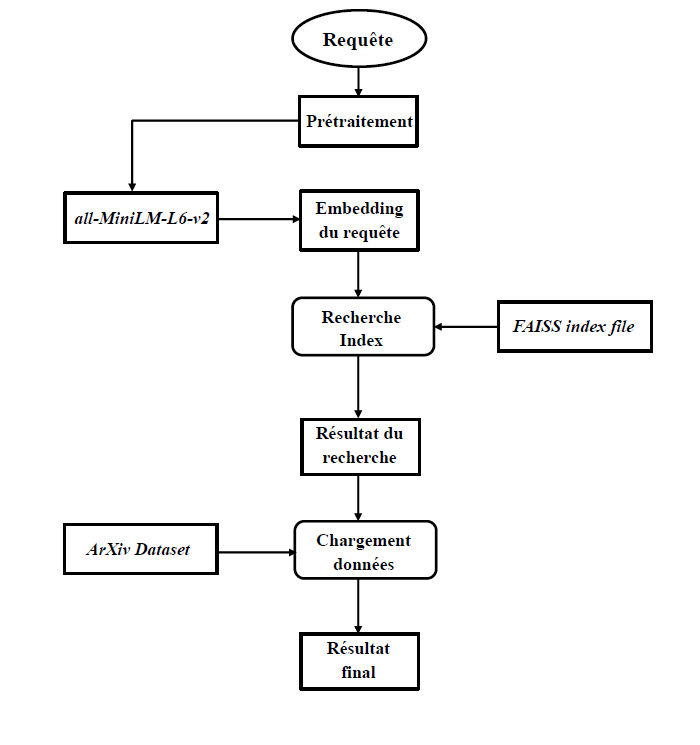

# Scientific Searcher : Outil de Recherche Sémantique pour Articles Scientifiques

Ce projet développe un moteur de recherche sémantique pour les articles scientifiques, permettant à un utilisateur de trouver les articles les plus pertinents en fonction d'une requête. En utilisant des techniques de **traitement automatique du langage naturel (NLP)**, des **embeddings de phrases**, et un système d'indexation rapide avec **FAISS**, l'application peut effectuer des recherches efficaces même sur de très grandes bases de données. 

Le modèle de base utilisé pour extraire les représentations vectorielles des articles est **all-MiniLM-L6-v2**, qui est un modèle léger et rapide permettant de capter la sémantique des titres et des résumés des articles scientifiques.

## Fonctionnement de l'Application

1. **Prétraitement des Données** : Les titres et résumés des articles sont nettoyés (suppression des formats LaTeX, normalisation des espaces, suppression des caractères inutiles) pour préparer le texte à l'analyse sémantique.
   
2. **Vectorisation des Articles** : Utilisation de la méthode **sentence embedding** avec le modèle `all-MiniLM-L6-v2` pour transformer chaque article en un vecteur numérique représentant son contenu sémantique.

3. **Indexation avec FAISS** : Une fois les embeddings générés, l'index FAISS est utilisé pour organiser et rechercher rapidement les articles les plus similaires à une requête donnée.

4. **Recherche Sémantique** : Lorsqu'une requête est saisie par l'utilisateur, elle est convertie en un embedding et comparée avec les embeddings des articles pour trouver les plus pertinents.

5. **Interface Utilisateur** : Une interface web simple est construite avec **FastAPI**, permettant à l'utilisateur de saisir une question ou un sujet et d'afficher les articles les plus pertinents.

## Diagramme de Fonctionnement

Insérez ici un diagramme ou une image pour expliquer le fonctionnement du système.

